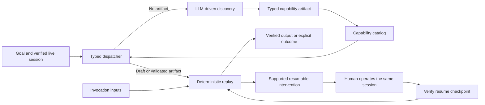

# Computer-Use Automation

**Discover a workflow with an LLM. Capture it as a typed capability. Replay it with explicit checks and human control.**

A computer-use automation project for applications that must be operated through their interface. The intended system learns a workflow through a real UI run, then executes a parameterized version without the model making replay decisions.

> **Status: the complete assessment slice is implemented and verified locally.** Genuine GPT-4o mini discovery produced a typed capability; different-input and cross-member replay completed with zero model calls. The runtime matrix covers business outcomes, bounded recovery, intervention, hard failure, ambiguity, and policy denial. Same-session handoff, the real HTTP control boundary, reviewed evidence export, and the required report are included.

## The problem

Legacy business applications often expose their workflows only through screens. Automating them requires more than repeating clicks: execution must identify the right record, verify the result, handle application errors, and stop safely when a person needs to intervene.

This project explores a separation between model-driven discovery and deterministic execution:



The model discovers the procedure. The artifact defines the reusable contract. The execution engine owns policy, verification, recovery, and control transfer.

## First discovery example

The first connected discovery journey is a transaction-history inquiry in a local, synthetic member-servicing application:

1. The employee finds and verifies a synthetic member in the managed browser.
2. The employee enters a goal such as “Show this member’s checking transactions for the last 7 days.”
3. The model receives a fresh visible-UI observation and proposes one typed action at a time.
4. The service validates and executes each action through Playwright, then observes again.
5. Independent code verifies the final member, account type, history screen, and period.

Follow-up scenarios exercise missing records, empty history, slow loads, permission errors, known and unknown dialogs, application failure, ambiguity, forbidden destinations, and expired sessions. No real banking credentials or member data are required.

## Engineering goals

| Area | Intended behavior |
|---|---|
| Capability contract | Versioned inputs, outputs, actions, targets, and completion checks |
| Deterministic replay | Declared rules govern execution; no model decisions |
| Runtime handling | Business outcomes, recoverable conditions, and failures remain distinct |
| Human intervention | Exclusive control of the same live session, recorded actions, verified resumption |
| Safety | Explicit action/target policy and sensitive-data handling before persistence |
| Observability | Correlated events and useful, sanitized failure evidence |
| Reliability | Bounded execution and tests for interruption, ambiguity, and recovery |

The quality target extends beyond a happy-path demonstration. Operational guarantees will be defined for a concrete deployment scope and backed by tests and evidence. This repository does not currently claim production readiness.

## Stack

React + TypeScript + Vite for the operator console and banking demo; Node.js + Express for their separate backend services; MongoDB + Mongoose for automation persistence; OpenAI for discovery; Playwright for browser control. Node's built-in test runner provides the backend checks.

Only the automation service needs a database connection. Banking data is bundled synthetic fixture data and must be read through the browser UI; `BANK_MONGODB_URI` is optional infrastructure plumbing and is not required for the demonstrated workflow.

## Project hub

| Document | Purpose |
|---|---|
| [Documentation index](docs/README.md) | Navigate the project and understand document status |
| [Sprint roadmap](docs/roadmap.md) | Feature increments, acceptance gates, and current progress |
| [Requirements](docs/requirements.md) | Assessment baseline and acceptance checklist |
| [Implementation plan](docs/implementation-plan.md) | Detailed proposed architecture, contracts, and trade-offs |

## Run and verify

To open the banking mock, only the installed Node/npm dependencies are needed:

```sh
npm run dev:bank
```

Open **http://127.0.0.1:5174**. Start at the workspace home, then navigate manually through Members, Accounts, and Transactions. Try **Alex Morgan**, date of birth **1988-04-12**, then synthetic SSN last four **4829**. Verify once to navigate their accounts and history; changing members or refreshing clears verification. No backend, MongoDB, or model connection is needed for this mock. See [banking mock notes](docs/banking-mock.md).

```sh
npm run test:bank-data
# With the banking dev server still running:
npm run test:bank-ui
```

The remaining commands configure the broader system. Prerequisites are Node.js 22.22.x and npm 10+. MongoDB is optional for this local slice; validated files provide the catalog and evidence fallback. No OpenAI key is needed for replay or the banking mock; a new genuine discovery requires one.

```sh
npm ci
cp .env.example .env
npm run browser:install
```

Use separate terminals for the project-local MongoDB process and the applications:

```sh
npm run db:local
```

```sh
npm run dev
```

| Surface | Local address |
|---|---|
| Operator console | http://127.0.0.1:5173 |
| Banking demo | http://127.0.0.1:5174 |
| Automation API health | http://127.0.0.1:3001/api/health |
| Banking API health | http://127.0.0.1:3002/api/health |

`/api/health` reports service liveness; `/api/ready` returns 503 until MongoDB connects. The UI shells check liveness only. They do not imply database or discovery readiness.

For the first discovery experiment, set `OPENAI_API_KEY` in the ignored `.env`; `OPENAI_MODEL` defaults to `gpt-4o-mini`. Run `npm run dev`, open the operator console, and choose **Launch banking workspace**. In the launched browser verify Alex Morgan with DOB `1988-04-12` and synthetic SSN last four `4829`, then enter:

```text
Show this member’s checking transactions for the last 7 days.
```

The automation API owns that browser page, so employee verification and model-directed Playwright actions share one live session. Local JSONL telemetry is written under ignored `.local/runs/<run-id>/events.jsonl`; when MongoDB is connected, the same safe event stream and current draft status are also stored in `discoveryRuns`.

```sh
npm run typecheck
npm test
npm run build
npm run runtime:system
npm run handoff:system
npm run stability:system
npm run evidence:export
npm run db:check
npm run persistence:system
npm run browser:check
```

The combined dev script supports macOS/Linux. On Windows, run the four `dev:*` scripts separately. The local MongoDB helper uses port 27018 and `.local/mongo`; it does not modify an existing instance on port 27017. It is a standalone development server, so multi-document transactions will require a replica-set deployment when that feature is introduced.

See [setup status and troubleshooting](docs/setup.md) for verification limits. Live discovery requires an authorized API key and run budget; build and automated tests do not invoke a model.

## Evidence and limitations

A genuine GPT-4o mini run has now operated the real local React banking UI with the fixed 500 ms post-action render delay. It used three model calls (3,636 input tokens and 164 output tokens) to open transaction inquiry, choose Alex Morgan’s checking account, and select seven-day history. Independent verification compiled a three-step draft. A 14-day validation replay extracted eight transactions, promoted the artifact, and emitted zero model-request events.

A separate process verified Jordan Lee, parsed the differently worded request “checking account activity for the last 14 days,” selected the persisted capability, and replayed it against checking account ending `7150`. It extracted two transactions with zero model requests. A 30-day replay traversed the target's second results page and extracted all 14 matching transactions. The runtime suite also retained missing-account and no-transaction business outcomes, slow-load and known-notice recovery, permission intervention, and application failure.

The reviewed bundle under [`evidence/`](evidence/) contains the genuine discovery, model-free replays, runtime outcomes, latest same-session handoff, and a 20-run stability study. All 20 repeated replays produced their expected result with consistent outputs and zero model requests; observed duration was 161–472 ms with a 471 ms p95 on the development machine. The manifest labels provenance, hashes exported files, and records successful API-key and PIN-canary scans. The HTTP integration additionally verifies token enforcement, exclusive ownership, premature-resume rejection, and stale/late command fencing.

The initial implementation targets one browser application. Desktop support and reuse across tenant variants remain explicit design extensions. See [`REPORT.md`](REPORT.md) for architecture, guarantees, evidence-backed behavior, and deliberate cuts.
