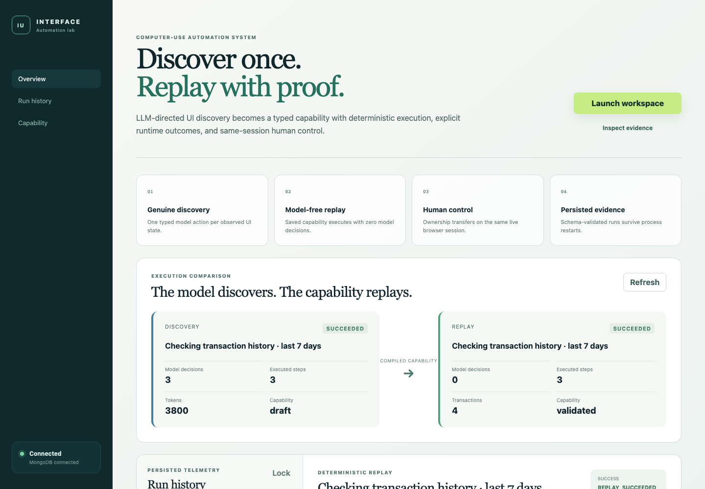
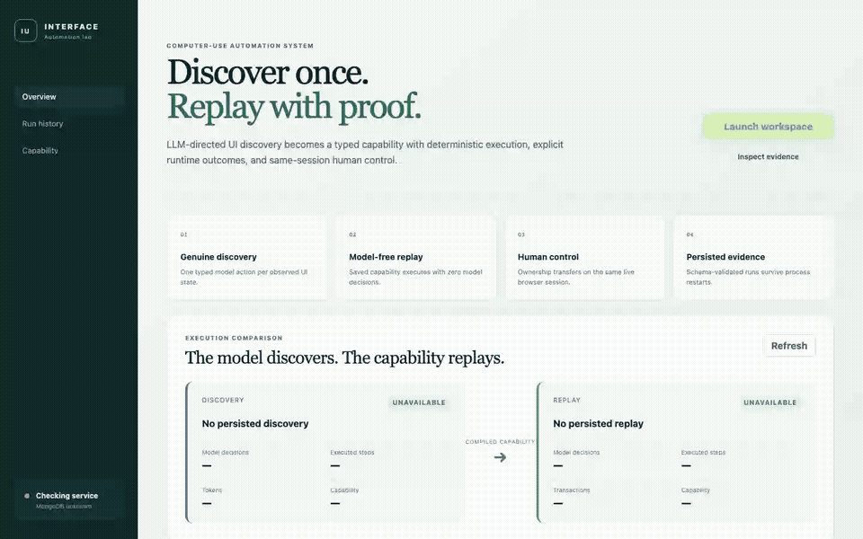
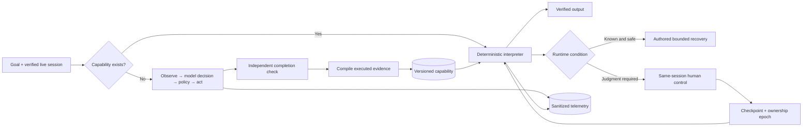
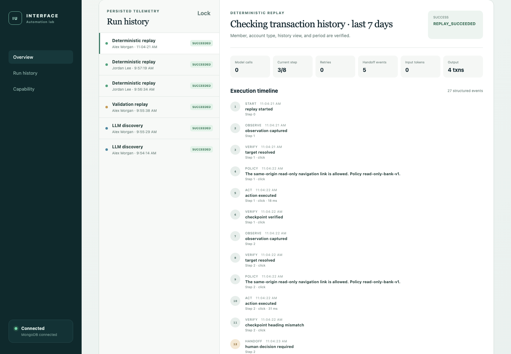

# Computer-Use Automation

**An LLM discovers a workflow once. A typed capability replays it without model decisions.**

[](https://github.com/bchauu/computer-use-automation/actions/workflows/ci.yml)

This project operates a synthetic employee banking interface through its visible UI. OpenAI drives one genuine discovery run, the system compiles the executed actions into a versioned capability, and a separate Playwright interpreter reuses that capability with different inputs and members. Every action is policy checked, every checkpoint is verified, and uncertain runtime states stop or transfer control to a person.



## See it work

[Watch the 27-second silent demo](docs/assets/demo.mp4) · [WebM](docs/assets/demo.webm)

The recording is a scripted, model-free product demonstration using the real React interfaces, automation API, Playwright session, and persisted MongoDB history. It first replays a 14-day transaction inquiry, then injects an unknown dialog to show explicit same-session human takeover.



## Verified results

| Claim | Checked evidence |
|---|---|
| Genuine UI discovery | GPT-4o mini chose 3 live UI actions from fresh observations: 3,636 input and 164 output tokens |
| Deterministic reuse | Different-period and cross-member replays completed with **0 model calls** |
| Complete extraction | A 30-day replay crossed pagination and returned all 14 matching transactions |
| Human control | Session expiry and an unknown dialog both paused, ceded the original page/context, fenced stale commands, and resumed after a verified checkpoint |
| Runtime behavior | Missing account, empty history, slow load, known notice, permission denial, application error, cancellation, ambiguity, and policy denial have explicit outcomes |
| Repeatability | 20/20 expected model-free outcomes with stable per-scenario output hashes; 161–472 ms observed, 471 ms p95 on the development machine |
| Sensitive evidence | Export rejects raw HTML, credential URIs, API-key patterns, and the synthetic PIN canary; every exported file is hashed |

The checked-in [evidence bundle](evidence/) contains 12 schema-validated runs, the validated capability, the stability study, and a hash manifest. The [acceptance matrix](docs/acceptance.md) maps each requirement to implementation and evidence.

## System flow



Discovery receives a compact structural inventory of the current UI and returns one schema-constrained action. Ordinary code validates the observation revision, target uniqueness, action effect, origin, policy, ownership, and budgets before execution. The artifact is compiled from actions that actually executed and observations that actually passed; a model-authored plan cannot become a capability by itself.

Replay imports no model transport and works without `OPENAI_API_KEY`. It resolves exact accessible targets, executes bounded actions, verifies every checkpoint, extracts current UI values, and returns success, business outcome, intervention, hard failure, or cancellation. A click whose effect becomes unknown is never blindly repeated.

## Demonstrated capability

The vertical slice answers a verified member's checking or savings transaction-history request for the latest entry or the last 7, 14, or 30 days.

1. An employee finds a synthetic member by name and date of birth.
2. The employee verifies the match with synthetic SSN last four.
3. They enter a request such as “Show this member's checking transactions for the last 14 days.”
4. Discovery or replay navigates the existing application through the UI.
5. The system verifies the member, account type, route, view, and period before extracting transactions.

The target is intentionally read-only and contains fictional Northline data. No real banking system, credentials, or customer data are used.

## Operator evidence

The operator console reads protected, persisted history from MongoDB. It compares the genuine discovery with replay, shows model and token counts, renders the event timeline and diagnostic phase, and exposes the exact capability that ran.



The API requires `x-operator-token` for run, evidence, and capability reads. The browser stores the local demo token in `sessionStorage`; it is never Vite bundled or checked in.

## Run locally

Prerequisites: Node.js 22.22.x, npm 10+, and Playwright Chromium. MongoDB is required for the persisted operator inspector; replay can also load the validated local capability without it. A new discovery requires an OpenAI API key.

```sh
npm ci
npm run browser:install
cp .env.example .env
```

Set a dedicated MongoDB database and a random local operator token in `.env`:

```dotenv
AUTOMATION_MONGODB_URI=mongodb://127.0.0.1:27018/computer_use_automation
OPERATOR_ACCESS_TOKEN=replace-with-a-long-random-value
```

For a new paid discovery, also set `OPENAI_API_KEY`; `OPENAI_MODEL` defaults to `gpt-4o-mini`. Do not place any secret in a `VITE_` variable.

Start the included local MongoDB helper and application stack in separate terminals:

```sh
npm run db:local
```

```sh
npm run dev
```

| Surface | Address |
|---|---|
| Operator console | http://127.0.0.1:5173 |
| Synthetic bank | http://127.0.0.1:5174 |
| Automation health | http://127.0.0.1:3001/api/health |

Launch the managed banking workspace from the operator console. For the primary fixture use **Alex Morgan**, **1988-04-12**, and synthetic SSN last four **4829**.

## Verify

The default checks do not call OpenAI or require its API key.

```sh
npm run check
npm run evidence:verify
npm run browser:check
```

Connected system checks use the configured local services:

```sh
npm run persistence:system
npm run runtime:system
npm run handoff:system
npm run handoff:decision
npm run stability:system
```

Generate the silent portfolio recording with `npm run demo:record`. Run `npm run live:system` only when a new authorized paid discovery is intended. More setup and troubleshooting details are in [docs/setup.md](docs/setup.md).

## Repository map

| Path | Responsibility |
|---|---|
| `apps/bank` | Synthetic legacy-style employee interface and injected runtime states |
| `apps/operator` | Session launcher, run comparison, history, timeline, diagnostics, capability view |
| `src/discovery` | Observation, model boundary, policy, compilation, replay, handoff, telemetry |
| `src/contracts` | Zod contracts for runs, artifacts, evidence, actions, and results |
| `src/automation` | Protected HTTP control and operator APIs |
| `evidence` | Reviewed, sanitized, hashed proof bundle |
| `docs` | Requirements, decisions, setup, roadmap, and traceability |

Start with the [documentation hub](docs/README.md), [assessment requirements](docs/requirements.md), and [final report](REPORT.md).

## Scope and limits

This is a strong bounded implementation, not a claim of production readiness. It supports one read-only browser capability and one synthetic application. It does not implement real identity, money movement, native desktop control, durable distributed workers, encrypted evidence storage, production RBAC, or hostile multi-tenant isolation. Product-version and tenant adapter seams are design boundaries; they are not evidence that those surfaces already work.

The important claim is narrower and tested: a real model can discover this UI workflow, executed evidence can become a reviewable capability, and that capability can replay without model decisions while handling known conditions, unknown states, and human ownership explicitly.
